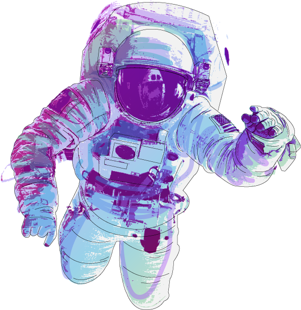

<h1 align="center">Hi 👋, I'm Daniil</h1>
<h3 align="center">MLOps, DL, data saentist</h3>

- 🔭 I’m currently working on [AlphaFile](https://github.com/MrAlphaFile/)

- 🌱 I’m currently learning **Deep Learning, YandexCatboost, Pytorch, QML**

- 👯 I’m looking to collaborate on [IsaacLab](https://github.com/isaac-sim/IsaacLab)

- 📝 I regularly write articles on [128bit.site](128bit.site)

- 💬 Ask me about **ML, datasince**

- 📫 How to reach me **128bit@128bit.xyz**

<h3 align="left">Connect with me:</h3>

<h3 align="left">Languages and Tools:</h3>

                 

